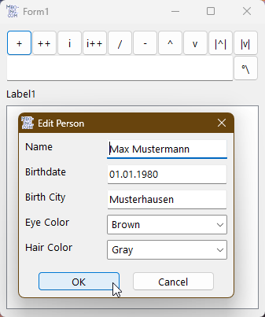

# Ctrl_DBcrud  
## UI-toolbar all CRUD, create read update delete AND add, add clone, insert, insert clone, move up, move down, sort up, sort down, search

 

For this repo you will also need the repos:  
* CCollection
* ModalDialog
  
This project covers all functions we need for creating a simple UI for creating a very complex object data hierarchy structure.  
In cunjunction with databases everyone thinks of CRUD which are the 4 basics:
* Create 
* Read 
* Update 
* Delete  

in our app we have classes and lists, imho basically this is all we need

Create:
-------
When creating an object, we could think of 4 basic scenarios. 
Creating a new ...
* ... fresh object, editing it and adding it at the end of a list
* ... object by cloning an existing one, 
      editing it, and adding it at the end of a list
* ... fresh object, editing it and inserting it at a certain spot in a list
* ... object by cloning an existing one 
      editing it, and inserting it at a certain spot in a list

Read:
-----
being able to explore all objects just by manually reading through all objects of a complex datastructure
but not only reading it but also functions for helping me finding certain objects, like 
* moving an object in the list up or down for the purpose of grouping objects visually standing together
* sorting all objects in the list according to a certain property
* searching for certain objects or the one object, in all objects and all properties of all objects

Update:
-------
being able to edit every object separately in one dialog, or maybe for convenience editing certain 
properties of several objects together at once in a list.

Delete:
-------
being able to delete every unwanted, unnecessary or needless object.

